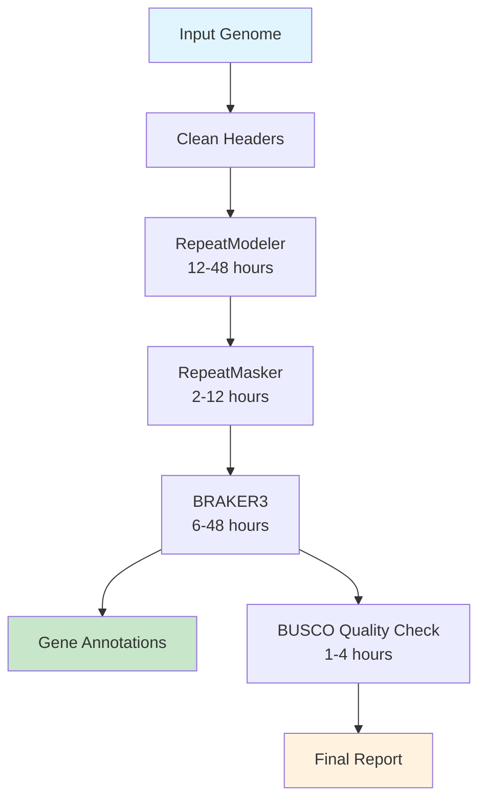

# Genome Annotation Pipeline

**Complete genome annotation pipeline: RepeatModeler → RepeatMasker → BRAKER3 → BUSCO**

[](https://docs.microsoft.com/en-us/windows/wsl/)
[](https://openjdk.java.net/)
[](https://www.nextflow.io/)
[](https://sylabs.io/)

## 🚀 Quick Start

**Choose your platform:**

### 🐧 Linux/WSL2 Users (Recommended)

```bash
# 1. Get the pipeline
git clone https://github.com/farahnini/genome-annotation.git
cd genome-annotation

# 2. Simple setup (works with any Java version)
chmod +x setup_simple.sh
./setup_simple.sh

# 3. Test it works
source activate_environment.sh
./test/run_test.sh

# 4. Run with your data
nextflow run main.nf --genome your_genome.fasta --species "your_species" -profile singularity
```

### 🪟 Windows Users

```powershell
# 1. Get the pipeline
git clone https://github.com/farahnini/genome-annotation.git
cd genome-annotation

# 2. Setup (PowerShell)
.\setup_test.ps1

# 3. Run pipeline (in WSL2)
wsl
source activate_environment.sh
./test/run_test.sh
```

**⚠️ Windows Note**: The pipeline runs in Linux containers. Windows users need WSL2 for the actual pipeline execution.

## 🧪 Testing & Validation

**Always test before using real data!**

```bash
# Quick system check
./check_installation.sh

# Activate environment
source activate_environment.sh

# Run test pipeline (~5 minutes)
./test/run_test.sh

# Or test individual components
nextflow run validate.nf --genome test/test_genome.fna
```

## 💻 Usage Examples

### Basic Usage
```bash
# Activate environment (if not already active)
source activate_environment.sh

# Basic annotation (genome only)
nextflow run main.nf \
  --genome your_genome.fasta \
  --species "Escherichia_coli" \
  -profile singularity

# With protein evidence (recommended)
nextflow run main.nf \
  --genome your_genome.fasta \
  --proteins protein_evidence.fasta \
  --species "Escherichia_coli" \
  -profile singularity

# Custom output directory
nextflow run main.nf \
  --genome your_genome.fasta \
  --species "Escherichia_coli" \
  --outdir my_results \
  -profile singularity
```

### Advanced Options
```bash
# Resume interrupted run
nextflow run main.nf --genome genome.fa --species "E_coli" -profile singularity -resume

# Use specific BUSCO database
nextflow run main.nf --genome genome.fa --species "E_coli" --busco_db bacteria_odb10 -profile singularity

# Resource-constrained systems
nextflow run main.nf --genome genome.fa --species "E_coli" -profile singularity -c test/minimal.config

# Use container manager (alternative approach)
./manage_container.sh run --genome genome.fa --species "E_coli"
```

## 📁 Results

```
results/
├── augustus.hints.gtf      # ← Your gene annotations (main result!)
├── augustus.hints.aa       # ← Predicted proteins  
├── busco_summary.txt       # ← Quality report
└── genome.masked           # ← Repeat-masked genome
```

## 🧪 Test First (REQUIRED)

**⚠️ IMPORTANT: Always run the test first to verify your setup!**

The test will:
- Verify Nextflow and Singularity are working
- Download small test data (~48kb Lambda phage genome)
- Run the complete pipeline in ~5-10 minutes
- Validate all tools and containers work correctly

```bash
# 1. Setup test data (downloads small test genome - REQUIRED!)
chmod +x setup_test.sh
./setup_test.sh --small-test

# 2. Validate your installation
./test/validate_setup.sh

# 3. Run pipeline validation check
nextflow run validate.nf --genome test/test_genome.fna

# 4. Run complete test pipeline (~5-10 min)
./test/run_test.sh
```

**Troubleshooting test setup:**
- If download fails, the script creates a minimal synthetic genome
- Test files should be: `test/test_genome.fna` and `test/test_proteins.faa`
- If tests fail, check `TROUBLESHOOTING.md` for common solutions

### Alternative test methods:
```bash
# Direct test run (after setup_test.sh)
nextflow run main.nf --genome test/test_genome.fna --species "test_virus" -profile singularity -c test/test_data.config

# Ultra-minimal test for resource-constrained systems
nextflow run main.nf --genome test/test_genome.fna --species "test_virus" -profile singularity -c test/ultra_minimal.config
```

## ⚙️ Common Options

```bash
# Basic (genome only)
nextflow run main.nf --genome genome.fa --species "E_coli" -profile singularity

# With protein evidence (better results)  
nextflow run main.nf --genome genome.fa --proteins proteins.fa --species "E_coli" -profile singularity

# Custom output location
nextflow run main.nf --genome genome.fa --species "E_coli" --outdir my_results -profile singularity
```

## ❓ Troubleshooting

| Problem | Quick Fix | Detailed Solution |
|---------|-----------|------------------|
| **Java compatibility issues** | `source activate_environment.sh` | Use `setup_simple.sh` |
| **"command not found" errors** | Run `./check_installation.sh` | Install missing tools |
| **Test data missing** | `./setup_test.sh --small-test` | Downloads/creates test files |
| **Container issues** | `./manage_container.sh build` | Rebuilds containers |
| **Memory errors** | Use `-c test/minimal.config` | Reduces resource requirements |
| **Windows compatibility** | Use WSL2 for execution | Install `wsl --install Ubuntu-22.04` |
| **Pipeline freezes** | Check `tail -f .nextflow.log` | Shows detailed error logs |

### Quick Fixes
```bash
# Fix most common issues
./fix_environment.sh           # Clean and restart setup
source activate_environment.sh # Fix Java compatibility  
./check_installation.sh        # Diagnose problems
```

**For comprehensive troubleshooting, see [`TROUBLESHOOTING.md`](TROUBLESHOOTING.md)**

## 🗂️ Available Scripts (Why so many?)

The pipeline includes multiple setup scripts for different use cases:

### 🎯 **Main Scripts** (Use these)
- **`setup_simple.sh`** ⭐ - **Recommended**: Works with any Java version, fixes compatibility automatically
- **`test/run_test.sh`** - Tests the pipeline with small data (~5 min)
- **`check_installation.sh`** - Diagnoses installation issues

### 🔧 **Alternative Setup Methods**
- **`setup_complete_environment.sh`** - Creates isolated environment (for complex setups)
- **`setup_environment.sh`** - Basic environment setup
- **`manage_container.sh`** - Container-based approach (advanced users)

### 🪟 **Windows-Specific**
- **`setup_test.ps1`** - PowerShell setup for Windows users
- **`run_pipeline.ps1`** - PowerShell wrapper for Windows

### 🛠️ **Utility Scripts**
- **`fix_environment.sh`** - Cleans up failed installations
- **`quick_start.sh`** - Shows all available options
- **`create_test_data.sh`** - Alternative test data creation

**Why so many?** Different users have different needs:
- **Beginners**: Use `setup_simple.sh` 
- **Java issues**: Use `setup_complete_environment.sh`
- **Windows users**: Use PowerShell scripts + WSL2
- **Advanced users**: Use container approach
- **Troubleshooting**: Multiple diagnostic and fix scripts

## 📁 Output Files

After successful completion, find your results in the output directory:

```
results/
├── 📄 augustus.hints.gtf         # ← Main gene annotations (GFF3 format)
├── 🧬 augustus.hints.aa          # ← Predicted protein sequences
├── 📊 busco_summary.txt          # ← Quality assessment report
├── 🎭 genome.masked              # ← Repeat-masked genome
├── 📈 annotation_summary.html    # ← Comprehensive report
├── 📋 pipeline_info/             # ← Run statistics and logs
│   ├── execution_report.html
│   ├── execution_timeline.html
│   └── pipeline_dag.svg
└── 🔬 intermediate_files/        # ← Process outputs
    ├── repeatmodeler/
    ├── repeatmasker/
    ├── braker3/
    └── busco/
```

### Key Result Files
- **`augustus.hints.gtf`**: Your main gene annotation file in GTF format
- **`augustus.hints.aa`**: Protein sequences for predicted genes
- **`busco_summary.txt`**: Quality metrics showing completeness
- **`annotation_summary.html`**: Interactive summary report
- **`genome.masked`**: Input genome with repetitive regions masked

## 🚀 What This Pipeline Does



1. **🧹 Clean Headers** - Standardizes FASTA sequence names
2. **🔍 RepeatModeler** - Identifies repetitive DNA elements *de novo*
3. **🎭 RepeatMasker** - Masks repetitive regions using custom library
4. **🧬 BRAKER3** - Predicts genes using masked genome ± protein/RNA evidence
5. **📊 BUSCO** - Assesses annotation completeness and quality

**Total Runtime**: ~1-4 days for typical bacterial/fungal genomes

## 📋 System Requirements

### Minimum Requirements
- **OS**: Linux or WSL2 (Windows 10/11)
- **RAM**: 8 GB (16 GB recommended)
- **CPU**: 4 cores (8+ cores recommended)  
- **Storage**: 50 GB free space
- **Java**: 11 or 17 (auto-managed with container setup)

### Recommended for Large Genomes (>1 Gb)
- **RAM**: 64 GB+
- **CPU**: 16+ cores
- **Storage**: 500 GB+ (preferably SSD)
- **Time**: 3-7 days

### Container Requirements
- **Singularity**: 3.8+ or Apptainer 1.0+
- **Docker**: 20.10+ (alternative to Singularity)
- **Internet**: Required for initial container download (~2-5 GB)

## 🏗️ Key Files & Directories

```
genome-annotation/
├── 🔧 main.nf                    # Main pipeline workflow
├── ⚙️  nextflow.config           # Pipeline configuration  
├── 📜 setup_simple.sh           # ⭐ Recommended setup script
├── 📜 activate_environment.sh    # Environment activation (created by setup)
├── 🧪 test/                      # Test data and configurations
│   ├── run_test.sh              # Test runner
│   ├── validate_setup.sh        # Setup validator
│   └── *.config                 # Resource configurations
├── 📁 modules/                   # Pipeline process modules
├── 📁 containers/                # Container definitions
└── 📋 README.md                  # This file
```

**After setup, your results will be in:**
```
results/
├── 📄 augustus.hints.gtf         # ← Main gene annotations
├── 🧬 augustus.hints.aa          # ← Predicted proteins  
├── 📊 busco_summary.txt          # ← Quality report
└── 🎭 genome.masked              # ← Repeat-masked genome
```

## 🤝 Support & Contributing

### Getting Help
1. **Quick diagnosis**: Run `./check_installation.sh`
2. **Check logs**: View `.nextflow.log` for detailed errors  
3. **Review issues**: Browse [GitHub Issues](https://github.com/farahnini/genome-annotation/issues)
4. **Try clean setup**: Use `./fix_environment.sh` then `./setup_simple.sh`

### System Requirements
- **OS**: Linux or WSL2 (Windows 10/11)
- **RAM**: 8+ GB (16+ GB recommended)
- **CPU**: 4+ cores (8+ cores recommended)
- **Storage**: 50+ GB free space
- **Java**: Any version (auto-managed by setup scripts)
- **Internet**: Required for container downloads

### Performance Guidelines
- **Small genomes** (<100 Mb): 2-8 hours, 8 GB RAM
- **Typical genomes** (100 Mb - 1 Gb): 1-3 days, 16+ GB RAM  
- **Large genomes** (>1 Gb): 3-7 days, 64+ GB RAM

---

**Questions? Issues? Check [`TROUBLESHOOTING.md`](TROUBLESHOOTING.md) or open a GitHub issue!**

**Happy genome annotating! 🧬🔬**
