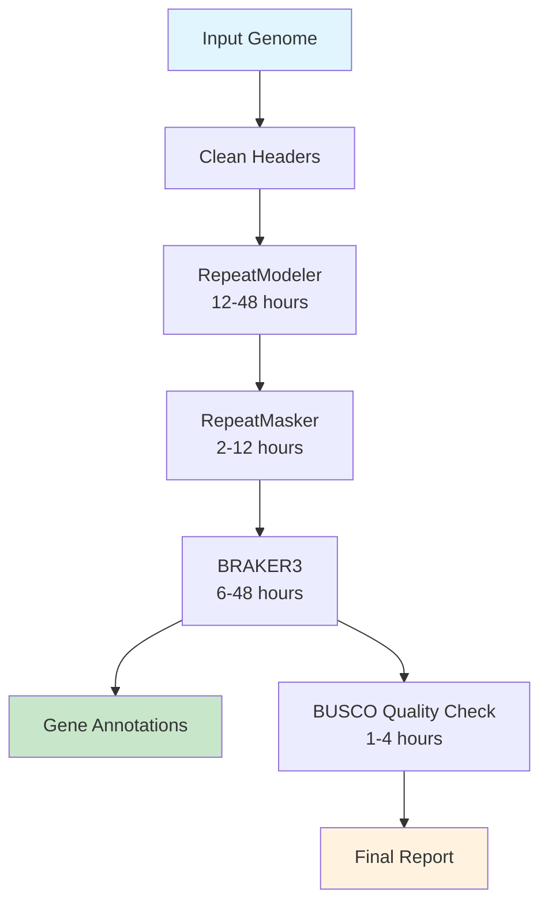

# Genome Annotation Pipeline

**Complete genome annotation in 3 steps: RepeatModeler → RepeatMasker → BRAKER3 → BUSCO**

[](https://docs.microsoft.com/en-us/windows/wsl/)
[](https://openjdk.java.net/)
[](https://www.nextflow.io/)
[](https://sylabs.io/)

## 🎯 Three Setup Methods

Choose the method that works best for your system:

### Method 1: 🐳 Complete Environment (Recommended for Java issues)
**Perfect for Java compatibility problems or clean environments**

```bash
# 1. Get pipeline
git clone https://github.com/farahnini/genome-annotation.git
cd genome-annotation

# 2. One-command setup (handles all dependencies)
chmod +x setup_complete_environment.sh
./setup_complete_environment.sh

# 3. Test everything works
./manage_container.sh test

# 4. Run with your data
./manage_container.sh run --genome your_genome.fasta --species "your_species"
```

### Method 2: 🔧 Manual Installation
**For users who want control over their environment**

```bash
# 1. Install prerequisites
curl -s https://get.nextflow.io | bash && sudo mv nextflow /usr/local/bin/
sudo apt install -y singularity-ce openjdk-17-jdk

# 2. Get pipeline and check installation
git clone https://github.com/farahnini/genome-annotation.git
cd genome-annotation
chmod +x check_installation.sh
./check_installation.sh

# 3. Setup test data and validate
./setup_test.sh --small-test
./test/run_test.sh
```

### Method 3: 🌟 Environment Manager
**Automatically detects and fixes environment issues**

```bash
# 1. Get pipeline
git clone https://github.com/farahnini/genome-annotation.git
cd genome-annotation

# 2. Auto-setup environment
chmod +x setup_environment.sh
./setup_environment.sh

# 3. Test and run
./test/run_test.sh
```

## 🧪 Testing Your Setup

**⚠️ ALWAYS test first before running on real data!**

### Quick Test (5 minutes)
```bash
# Option 1: Using container manager
./manage_container.sh run --genome test/test_genome.fna --species "test_virus" -c test/ultra_minimal.config

# Option 2: Direct test
./test/run_test.sh

# Option 3: Manual test
nextflow run main.nf --genome test/test_genome.fna --species "test_virus" -profile singularity
```

### Troubleshooting Tests
```bash
# Check your installation
./check_installation.sh

# Create test data if missing
./setup_test.sh --small-test

# Validate setup
./test/validate_setup.sh

# Test individual components
nextflow run validate.nf --genome test/test_genome.fna
```

## 🔧 Running Your Data

### Basic Usage
```bash
# Method 1: Using container (recommended)
./manage_container.sh run --genome your_genome.fasta --species "your_species"

# Method 2: Direct command
nextflow run main.nf --genome your_genome.fasta --species "your_species" -profile singularity

# Method 3: With protein evidence (better results)
nextflow run main.nf --genome genome.fa --proteins proteins.fa --species "E_coli" -profile singularity
```

### Advanced Options
```bash
# Custom output directory
nextflow run main.nf --genome genome.fa --species "E_coli" --outdir my_results -profile singularity

# Resume failed runs
nextflow run main.nf --genome genome.fa --species "E_coli" -profile singularity -resume

# Use specific BUSCO database
nextflow run main.nf --genome genome.fa --species "E_coli" --busco_db bacteria_odb10 -profile singularity

# Resource-constrained systems
nextflow run main.nf --genome genome.fa --species "E_coli" -profile singularity -c test/minimal.config
```

## 📁 Results

```
results/
├── augustus.hints.gtf      # ← Your gene annotations (main result!)
├── augustus.hints.aa       # ← Predicted proteins  
├── busco_summary.txt       # ← Quality report
└── genome.masked           # ← Repeat-masked genome
```

## 🧪 Test First (REQUIRED)

**⚠️ IMPORTANT: Always run the test first to verify your setup!**

The test will:
- Verify Nextflow and Singularity are working
- Download small test data (~48kb Lambda phage genome)
- Run the complete pipeline in ~5-10 minutes
- Validate all tools and containers work correctly

```bash
# 1. Setup test data (downloads small test genome - REQUIRED!)
chmod +x setup_test.sh
./setup_test.sh --small-test

# 2. Validate your installation
./test/validate_setup.sh

# 3. Run pipeline validation check
nextflow run validate.nf --genome test/test_genome.fna

# 4. Run complete test pipeline (~5-10 min)
./test/run_test.sh
```

**Troubleshooting test setup:**
- If download fails, the script creates a minimal synthetic genome
- Test files should be: `test/test_genome.fna` and `test/test_proteins.faa`
- If tests fail, check `TROUBLESHOOTING.md` for common solutions

### Alternative test methods:
```bash
# Direct test run (after setup_test.sh)
nextflow run main.nf --genome test/test_genome.fna --species "test_virus" -profile singularity -c test/test_data.config

# Ultra-minimal test for resource-constrained systems
nextflow run main.nf --genome test/test_genome.fna --species "test_virus" -profile singularity -c test/ultra_minimal.config
```

## ⚙️ Common Options

```bash
# Basic (genome only)
nextflow run main.nf --genome genome.fa --species "E_coli" -profile singularity

# With protein evidence (better results)  
nextflow run main.nf --genome genome.fa --proteins proteins.fa --species "E_coli" -profile singularity

# Custom output location
nextflow run main.nf --genome genome.fa --species "E_coli" --outdir my_results -profile singularity
```

## ❓ Troubleshooting Common Issues

| Problem | Solution | Script |
|---------|----------|---------|
| **Java compatibility (Java 18+)** | Use complete environment setup | `./setup_complete_environment.sh` |
| **"nextflow: command not found"** | Install with environment manager | `./setup_environment.sh` |
| **"singularity: command not found"** | Install Singularity/Apptainer | `sudo apt install -y singularity-ce` |
| **Test data missing** | Run setup script | `./setup_test.sh --small-test` |
| **Container issues** | Use container manager | `./manage_container.sh build` |
| **Memory errors** | Use minimal config | `-c test/minimal.config` |
| **Windows users** | Install WSL2 | `wsl --install Ubuntu-22.04` |
| **Pipeline stuck** | Check detailed logs | `tail -f .nextflow.log` |
| **Permission errors** | Make scripts executable | `chmod +x *.sh test/*.sh` |

### 🆘 Detailed Troubleshooting

```bash
# Complete system check
./check_installation.sh

# Fix Java issues automatically
./setup_complete_environment.sh

# Interactive container shell for debugging
./manage_container.sh shell

# Clean up and start fresh
./manage_container.sh clean
singularity cache clean --force
```

**For detailed troubleshooting guides, see [`TROUBLESHOOTING.md`](TROUBLESHOOTING.md)**

## 🛠️ Advanced Environment Management

### Container Management
```bash
# Build complete environment container (includes all tools)
./manage_container.sh build

# Test container functionality
./manage_container.sh test

# Run pipeline with container
./manage_container.sh run --genome genome.fa --species "E_coli"

# Interactive debugging shell
./manage_container.sh shell

# Container information
./manage_container.sh info

# Clean up containers
./manage_container.sh clean
```

### Environment Profiles
```bash
# Standard profile (uses system tools)
nextflow run main.nf --genome genome.fa -profile standard

# Singularity profile (recommended)
nextflow run main.nf --genome genome.fa -profile singularity

# Docker profile
nextflow run main.nf --genome genome.fa -profile docker

# Cluster profile (SLURM)
nextflow run main.nf --genome genome.fa -profile cluster

# Laptop profile (resource-constrained)
nextflow run main.nf --genome genome.fa -profile laptop
```

### Java Version Management
The pipeline automatically handles Java version compatibility:

- **Java 8**: ⚠️ May work, but not recommended
- **Java 11**: ✅ Fully supported and recommended
- **Java 17**: ✅ Fully supported and recommended  
- **Java 18+**: ❌ Not compatible with Nextflow

If you have Java compatibility issues, use the complete environment setup:
```bash
./setup_complete_environment.sh
```

## 📁 Output Files

After successful completion, find your results in the output directory:

```
results/
├── 📄 augustus.hints.gtf         # ← Main gene annotations (GFF3 format)
├── 🧬 augustus.hints.aa          # ← Predicted protein sequences
├── 📊 busco_summary.txt          # ← Quality assessment report
├── 🎭 genome.masked              # ← Repeat-masked genome
├── 📈 annotation_summary.html    # ← Comprehensive report
├── 📋 pipeline_info/             # ← Run statistics and logs
│   ├── execution_report.html
│   ├── execution_timeline.html
│   └── pipeline_dag.svg
└── 🔬 intermediate_files/        # ← Process outputs
    ├── repeatmodeler/
    ├── repeatmasker/
    ├── braker3/
    └── busco/
```

### Key Result Files
- **`augustus.hints.gtf`**: Your main gene annotation file in GTF format
- **`augustus.hints.aa`**: Protein sequences for predicted genes
- **`busco_summary.txt`**: Quality metrics showing completeness
- **`annotation_summary.html`**: Interactive summary report
- **`genome.masked`**: Input genome with repetitive regions masked

## 🚀 What This Pipeline Does



1. **🧹 Clean Headers** - Standardizes FASTA sequence names
2. **🔍 RepeatModeler** - Identifies repetitive DNA elements *de novo*
3. **🎭 RepeatMasker** - Masks repetitive regions using custom library
4. **🧬 BRAKER3** - Predicts genes using masked genome ± protein/RNA evidence
5. **📊 BUSCO** - Assesses annotation completeness and quality

**Total Runtime**: ~1-4 days for typical bacterial/fungal genomes

## 📋 System Requirements

### Minimum Requirements
- **OS**: Linux or WSL2 (Windows 10/11)
- **RAM**: 8 GB (16 GB recommended)
- **CPU**: 4 cores (8+ cores recommended)  
- **Storage**: 50 GB free space
- **Java**: 11 or 17 (auto-managed with container setup)

### Recommended for Large Genomes (>1 Gb)
- **RAM**: 64 GB+
- **CPU**: 16+ cores
- **Storage**: 500 GB+ (preferably SSD)
- **Time**: 3-7 days

### Container Requirements
- **Singularity**: 3.8+ or Apptainer 1.0+
- **Docker**: 20.10+ (alternative to Singularity)
- **Internet**: Required for initial container download (~2-5 GB)

## 🏗️ Project Structure

```
genome-annotation/
├── 📋 README.md                  # This file
├── 📋 TROUBLESHOOTING.md         # Detailed troubleshooting guide
├── 🔧 main.nf                    # Main pipeline workflow
├── ⚙️  nextflow.config           # Pipeline configuration
├── 🧪 validate.nf               # Validation workflow
├── 📜 setup_complete_environment.sh  # Complete environment setup
├── 📜 setup_environment.sh       # Basic environment setup  
├── 📜 manage_container.sh        # Container management
├── 📜 check_installation.sh      # Installation verification
├── 📜 setup_test.sh              # Test data setup
├── 📁 conf/                      # Configuration files
│   └── environments.config
├── 📁 containers/                # Container definitions
│   ├── genome-annotation.def
│   └── genome-annotation-complete.def
├── 📁 modules/                   # Process modules
│   ├── clean_headers.nf
│   ├── repeatmodeler.nf
│   ├── repeatmasker.nf
│   ├── braker3.nf
│   └── busco.nf
├── 📁 test/                      # Test data and configs
│   ├── run_test.sh
│   ├── validate_setup.sh
│   ├── test_data.config
│   ├── minimal.config
│   └── ultra_minimal.config
└── 📁 scripts/                   # Utility scripts
    └── generate_summary.ps1
```

## 🤝 Contributing & Support

### Getting Help
1. **Check existing issues**: Browse [GitHub Issues](https://github.com/farahnini/genome-annotation/issues)
2. **Run diagnostics**: Use `./check_installation.sh` for system checks
3. **Review logs**: Check `.nextflow.log` for detailed error information
4. **Try container approach**: Use `./setup_complete_environment.sh` for clean environment

### Reporting Issues
When reporting problems, please include:
- Output from `./check_installation.sh`
- Your system info: `uname -a` and available resources
- Nextflow version: `nextflow -version`
- Error messages from `.nextflow.log`
- Command that failed

### License
This pipeline is released under the MIT License. See [LICENSE](LICENSE) for details.

### Citation
If you use this pipeline in your research, please cite:
```
[Pipeline Citation - To be updated]
```

---

**Happy annotating! 🧬🔬**
